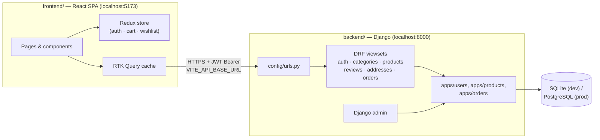
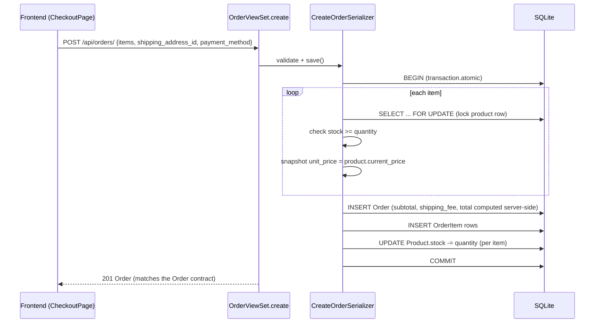

# ShopSphere

A full-stack e-commerce project: a Django REST backend and a React storefront.

| Layer | Status | Stack |
| --- | --- | --- |
| **Frontend** | ✅ Complete storefront UI | React 19, TypeScript, Vite, Tailwind CSS v4, Redux Toolkit + RTK Query, React Router v7 |
| **Backend** | ✅ Full REST API implementing the contract below | Django, Django REST Framework, SimpleJWT, SQLite (dev) |

The two were developed against a shared contract rather than the frontend polling a live API as
it went: [`frontend/API_CONTRACT.md`](frontend/API_CONTRACT.md) specifies every endpoint the
frontend expects (request/response shapes, query params, error format). The backend now
implements that contract end to end — see [Project status](#project-status) for exactly what's
covered and what's intentionally still a stub (payments gateway, deployment config).

---

## Repository layout

```
ShopShpere/
├── backend/                 Django project
│   ├── apps/
│   │   ├── users/              User (email login), Address models + serializers/views/urls
│   │   ├── products/            Category, Product, ProductImage, Review + serializers/views/urls
│   │   ├── orders/               Order, OrderItem models + transactional create/cancel endpoints
│   │   └── payments/             (unused — payment_method is just a field on Order for now)
│   ├── config/                  settings.py, urls.py, pagination.py, asgi/wsgi
│   ├── manage.py
│   └── requirements.txt
│
└── frontend/                 React storefront (Vite)
    ├── src/
    │   ├── api/                  RTK Query endpoints, one file per REST resource
    │   ├── app/                   Redux store + typed hooks
    │   ├── components/            UI kit, layout, product/account components
    │   ├── features/               auth/cart/wishlist Redux slices
    │   ├── lib/                    constants + formatting helpers
    │   ├── pages/                  route-level components
    │   └── types/                  domain types mirroring the DRF serializers
    ├── README.md                 frontend architecture deep-dive (diagrams, state
    │                              management, auth flow, routing, design system)
    └── API_CONTRACT.md           the REST contract both halves are built against
```

For anything frontend-specific — how state is split between Redux and RTK Query, the JWT
refresh flow, the routing map, the design system, how it was built — see
**[`frontend/README.md`](frontend/README.md)**. This root README stays at the "how do the two
halves fit together" level.

---

## Architecture



Auth is stateless JWT (SimpleJWT): the frontend stores an access/refresh token pair, attaches the
access token to every request, and silently refreshes it on a 401 — see
[`frontend/README.md#auth--token-refresh`](frontend/README.md#auth--token-refresh) for the exact
sequence. `TokenObtainPairView` uses the custom `User.USERNAME_FIELD = "email"` as-is, so login
takes `{ email, password }` with no customization needed. CORS is handled by
`django-cors-headers`; `CORS_ALLOWED_ORIGINS` in the backend `.env` must include the frontend's
dev origin (`http://localhost:5173` by default).

### Request lifecycle: placing an order



Prices and stock are never trusted from the client — `CreateOrderSerializer.create()`
(`backend/apps/orders/serializers.py`) row-locks each product, re-validates stock, and computes
`subtotal`/`shipping_fee`/`total` itself inside a single DB transaction. Cancelling an order
(`POST /api/orders/:id/cancel/`) reverses the stock decrement the same way.

---

## Getting started

You'll need **Python 3.12+** and **Node 20+**. Run the backend and frontend in two terminals.

### Backend

```bash
cd backend
python -m venv venv
venv\Scripts\activate          # macOS/Linux: source venv/bin/activate
pip install -r requirements.txt
```

Create `backend/.env` with at least:

```env
SECRET_KEY=change-me
DEBUG=True
CORS_ALLOWED_ORIGINS=http://localhost:5173
```

Then:

```bash
python manage.py migrate
python manage.py createsuperuser
python manage.py seed_demo_data     # optional: a few demo categories/products so the storefront isn't empty
python manage.py runserver          # http://localhost:8000
```

The Django admin (`/admin/`) manages categories/products/reviews/users/orders directly, and the
full REST API described in [`frontend/API_CONTRACT.md`](frontend/API_CONTRACT.md) is live at
`/api/...` — see that file for the exact endpoint list.

### Frontend

```bash
cd frontend
npm install
cp .env.example .env               # defaults already point at http://localhost:8000/api
npm run dev                        # http://localhost:5173
```

With both running, `http://localhost:5173` is a fully working storefront against a real backend:
browse the seeded catalog, register/log in, add to cart, check out, and see the order under
`/account/orders`. See [`frontend/README.md#getting-started`](frontend/README.md#getting-started)
for scripts, environment variables, and conventions.

---

## Project status

- [x] Data models: `User`, `Address`, `Category`, `Product`, `ProductImage`, `Review`, `Order`,
      `OrderItem`
- [x] Django admin wired up for all of the above
- [x] Full frontend UI: catalog (search/filter/sort/pagination), product detail, cart, checkout,
      JWT auth, account area (profile/orders/addresses/wishlist)
- [x] Full REST API matching `frontend/API_CONTRACT.md`: JWT auth (register/login/refresh/me),
      categories, products (search/filter/ordering/related), reviews (with duplicate-review and
      owner-only edit/delete protection), addresses (with single-default enforcement), orders
      (transactional create with server-side pricing/stock, list, detail, cancel with restock)
- [x] `seed_demo_data` management command for a non-empty catalog out of the box
- [ ] `payments` app: no real payment gateway — `payment_method` is stored on the order but
      nothing actually charges a card / initiates an M-Pesa STK push yet
- [ ] Automated tests — `tests.py` stubs exist in every backend app but are empty. The API was
      verified end-to-end manually (register → login → browse/filter products → review → address
      → order → cancel, plus auth-gating on every protected endpoint); a DRF `APITestCase` suite
      covering the same paths would be the natural next step.
- [ ] Deployment configuration (currently dev-only: SQLite, `DEBUG=True`, Vite dev server, no
      Postgres/Docker/CI setup despite `psycopg2-binary` already being in `requirements.txt`)

## Contributing

Each half has its own conventions doc — see the **Conventions** section of
[`frontend/README.md`](frontend/README.md) for frontend patterns (path aliases, type-only imports,
client vs. server state, styling). On the backend: business logic that needs a DB transaction
(order creation/cancellation) lives in the serializer's `create`/view's action, not the view
itself; permissions are per-viewset (`permission_classes`) rather than global, since read access
is public but writes are scoped to the owning user almost everywhere.
