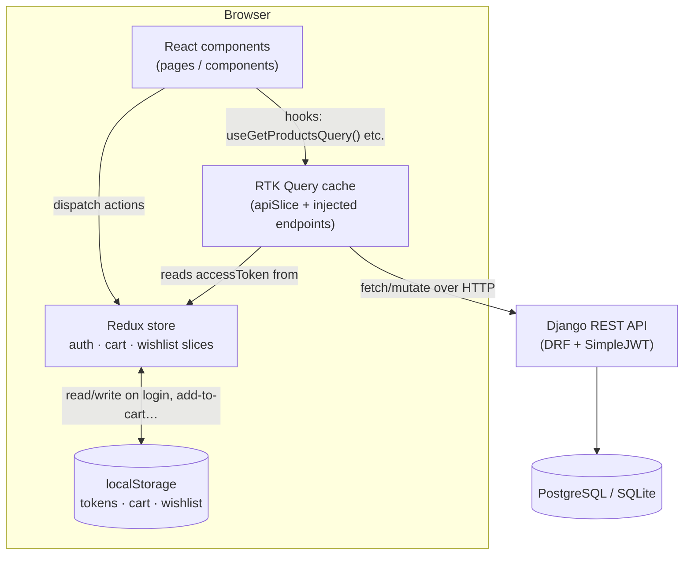
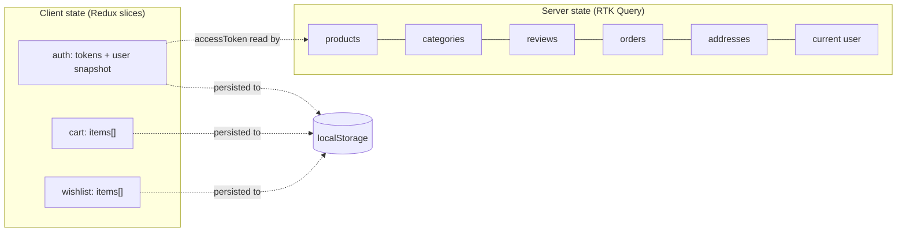
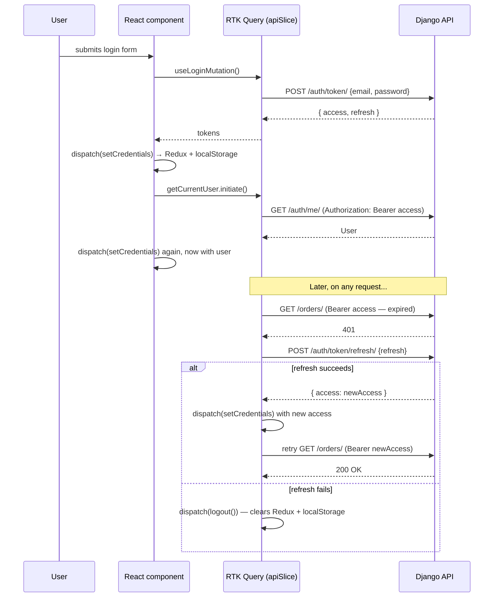
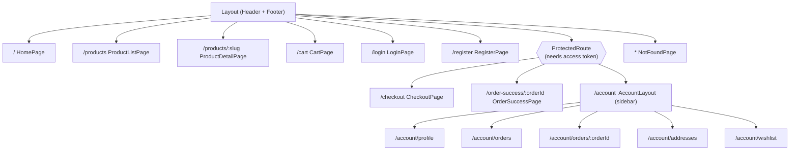
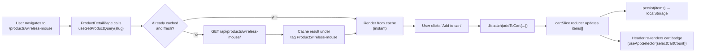

# ShopSphere — Frontend

The React storefront for ShopSphere: product catalog, cart, checkout, auth, and account
management. This document covers how the app is put together, why it's structured that way, and
how it talks to the Django backend.

> Backend contract: see [`API_CONTRACT.md`](./API_CONTRACT.md) for the exact endpoints this app
> talks to. The Django backend now implements the full contract (see the root
> [`README.md`](../README.md) for backend setup) — the one gap is a real payment gateway; the
> `payment_method` chosen at checkout is stored on the order but nothing actually charges it yet.

---

## Table of contents

1. [Stack & why](#stack--why)
2. [Architecture at a glance](#architecture-at-a-glance)
3. [Project structure](#project-structure)
4. [State management](#state-management)
5. [Auth & token refresh](#auth--token-refresh)
6. [Routing map](#routing-map)
7. [Data flow: from click to screen](#data-flow-from-click-to-screen)
8. [Design system](#design-system)
9. [Forms & validation](#forms--validation)
10. [Cart & wishlist persistence](#cart--wishlist-persistence)
11. [How this was built](#how-this-was-built)
12. [Getting started](#getting-started)
13. [Environment variables](#environment-variables)
14. [Scripts](#scripts)
15. [Conventions](#conventions)
16. [Known follow-ups](#known-follow-ups)

---

## Stack & why

| Concern             | Choice                          | Why |
| -------------------- | -------------------------------- | --- |
| Build tool            | **Vite** (React + TS template)  | Fast dev server, zero-config TS/JSX, first-class Tailwind v4 plugin |
| UI library            | **React 19**                    | Team familiarity, huge ecosystem, matches project scope |
| Styling               | **Tailwind CSS v4**              | Utility-first, no separate design-token layer to maintain; theme lives in `src/index.css` via `@theme` instead of a JS config file |
| Server state / caching | **RTK Query**                   | Request de-duping, cache invalidation via tags, loading/error states for free — avoids hand-rolled `useEffect` fetch logic |
| Client state           | **Redux Toolkit slices**        | Only for state RTK Query *can't* own: auth tokens, cart, wishlist. Kept deliberately small |
| Routing                | **React Router v7**              | Nested routes + `<Outlet>` map cleanly onto `Layout` → `AccountLayout` → page |
| Forms                  | **React Hook Form + Zod**        | Uncontrolled inputs (fewer re-renders) with schema validation shared between the type and the runtime check |
| Icons                  | **lucide-react**                 | Tree-shakeable, consistent stroke style |
| Notifications          | **react-hot-toast**              | Small, unopinionated toast primitive |

No component library (MUI, Chakra, shadcn) was pulled in — the UI kit in
`src/components/ui/` is hand-rolled on top of Tailwind so there's no fighting a library's theme
system, and it's small enough (11 files) that the maintenance cost is low.

---

## Architecture at a glance



The split is deliberate: **RTK Query owns anything that lives on the server** (products,
categories, reviews, orders, addresses, the current user). **Redux slices own only what's
client-side and needs to survive a refresh** (JWT tokens, cart contents, wishlist). Nothing is
duplicated between the two.

---

## Project structure

```
src/
├── api/            RTK Query endpoint definitions — one file per REST resource
│   ├── apiSlice.ts     base query + 401 → refresh-token → retry logic (the only file that talks HTTP directly)
│   ├── authApi.ts      login / register / current user
│   ├── productsApi.ts  product list / detail / related / featured
│   ├── categoriesApi.ts
│   ├── reviewsApi.ts
│   ├── addressesApi.ts
│   └── ordersApi.ts
├── app/            Redux store wiring
│   ├── store.ts        configureStore, combines slices + apiSlice.reducer
│   └── hooks.ts         typed useAppDispatch / useAppSelector
├── components/
│   ├── ui/              Design-system primitives: Button, Input, Select, Rating, Badge, Pagination…
│   ├── layout/           Header, Footer, Layout (the <Outlet/> shell), SearchBar
│   ├── product/           ProductCard, ProductGrid, ProductFilters, ReviewForm, ReviewItem
│   ├── account/           AddressForm (shared by checkout + address book)
│   ├── ErrorBoundary.tsx  catches render errors app-wide
│   └── ProtectedRoute.tsx redirects to /login when there's no access token
├── features/        Redux slices — client-side state only
│   ├── auth/authSlice.ts       tokens + user, mirrored to localStorage
│   ├── cart/cartSlice.ts       cart items, mirrored to localStorage
│   └── wishlist/wishlistSlice.ts
├── lib/
│   ├── constants.ts     env-derived config, storage keys, shipping thresholds
│   └── utils.ts          formatCurrency, cn (classnames), resolveMediaUrl, etc.
├── pages/           Route-level components (see the routing map below)
│   ├── account/           the authenticated area (profile, orders, addresses, wishlist)
│   └── auth/              login / register
└── types/index.ts   Domain types mirroring the DRF serializers (Product, Order, Address…)
```

Everything under `src/` is imported via the `@/` path alias (e.g. `@/components/ui/Button`)
instead of relative `../../..` chains — configured in `tsconfig.app.json` (`paths`) and
`vite.config.ts` (`resolve.alias`).

---

## State management



- **`apiSlice`** (`src/api/apiSlice.ts`) is the single RTK Query instance. Every resource file
  (`productsApi.ts`, `ordersApi.ts`, …) calls `apiSlice.injectEndpoints(...)` rather than creating
  its own `createApi` — this keeps one shared cache and one shared middleware.
- Cache invalidation uses **tags**: e.g. creating a review invalidates
  `{ type: 'Review', id: 'PRODUCT_<id>' }`, which refetches exactly the reviews list for that
  product — not the whole product catalog.
- Slices intentionally do *not* use `redux-persist`. Persistence is a couple of lines of manual
  `localStorage.getItem`/`setItem` in each slice's initializer and reducers — one less dependency,
  and it's obvious where the read/write happens (grep for `persist(` or `loadInitialState`).

---

## Auth & token refresh



This all happens inside `baseQueryWithReauth` in `src/api/apiSlice.ts` — components never see the
401/refresh dance, they just get a normal loading → success/error state. `ProtectedRoute.tsx`
gates `/checkout` and `/account/*`: no access token → redirect to `/login?redirect=<original path>`,
so a user is sent back to where they were after signing in.

---

## Routing map



All routes are declared in `src/App.tsx` using nested `<Route>` elements — `Layout` and
`AccountLayout` each render an `<Outlet/>` for their children, so the header/footer (or the
account sidebar) don't get re-mounted on every navigation.

---

## Data flow: from click to screen

Example: viewing a product page and adding it to the cart.



Every list/detail query follows the same shape: a hook call in the page component, a `Skeleton`/
`Spinner` while `isLoading`, an `EmptyState` for `isError` or empty results, and the real content
once data resolves — see `ProductGrid.tsx` for the canonical pattern reused across the app.

---

## Design system

`src/components/ui/` holds the primitives everything else is built from:

| Component | Purpose |
| --- | --- |
| `Button` | 5 variants (`primary/secondary/outline/ghost/danger`) × 3 sizes, built-in `isLoading` spinner |
| `Input` / `Textarea` / `Select` | Labelled form controls with inline error text, wired to RHF via `register()` |
| `Rating` / `RatingInput` | Read-only star display vs. clickable star picker (reviews) |
| `Badge` | Status pills (order status, sale %, stock level) |
| `ProductImage` | `` with a graceful icon fallback when a product has no image or the URL 404s |
| `QuantityInput` | +/− stepper clamped to `[min, stock]` |
| `Pagination`, `Breadcrumbs`, `EmptyState`, `SkeletonCard` | Shared list/empty/loading chrome |

Colors are defined once as Tailwind v4 theme tokens in `src/index.css`:

```css
@theme {
  --color-brand-50: #eef2ff;
  /* … brand-100 through brand-900 */
}
```

so `bg-brand-600`, `text-brand-700`, etc. are available everywhere without a `tailwind.config.js`.

---

## Forms & validation

Every form (login, register, review, address, profile) follows the same pattern:

1. A **Zod schema** defines the shape and validation rules.
2. `z.infer<typeof schema>` gives the TypeScript type for free — the type and the runtime check
   can never drift apart.
3. `useForm({ resolver: zodResolver(schema) })` wires it into React Hook Form.
4. On submit, the RTK Query mutation runs inside a `try/catch`; a failed request's
   `error.data.detail` (DRF's default error shape) is shown as a form-level error string.

See `src/components/product/ReviewForm.tsx` for the shortest example of the full pattern.

---

## Cart & wishlist persistence

Both are **client-only** — there is no server-side cart model, so anonymous users can add to cart
and check out (an order is only created at the very end of checkout, via `POST /orders/`, which
*does* require auth). Each slice:

- Reads its initial state from `localStorage` once, at module load (`loadInitialState()`).
- Writes back to `localStorage` inside every reducer that mutates state (`persist()`).
- Exposes memoized selectors (`selectCartCount`, `selectCartSubtotal`, `selectIsWishlisted`) so
  components like the header badge don't recompute on unrelated state changes.

---

## How this was built

Rough sequence, in case you're picking this project up and want the reasoning, not just the
result:

1. **Scaffolded** with `npm create vite@latest frontend -- --template react-ts` rather than
   hand-writing build config — Vite's own generator gets `tsconfig`/`vite.config` defaults right
   for the current toolchain version, which hand-rolled configs tend to drift from.
2. **Read the Django models first** (`backend/apps/{products,users}/models.py`) before writing a
   single type, so `src/types/index.ts` mirrors what the backend *will* serialize (field names,
   nullability, the `current_price`/`average_rating` computed properties) instead of guessing.
3. **Defined the API contract** (`API_CONTRACT.md`) as the interface between frontend and a
   not-yet-built backend — every RTK Query endpoint in `src/api/` was written against that
   document, so the two can be built in parallel and only need to agree on the contract.
4. **Bottom-up component build order**: `lib/utils.ts` + `types/` → Redux store/slices → RTK Query
   API layer → UI kit (`components/ui`) → layout chrome → feature components (`product/`,
   `account/`) → pages → routes. Each layer only depends on layers before it, which is why e.g.
   `ProductCard` never imports a page component.
5. **Verified with the compiler, not just the eye**: `npx tsc -b` (strict mode, `noUnusedLocals`/
   `noUnusedParameters` on), `npm run build` (production Vite build), and `npx oxlint src` were
   all run clean before considering any piece done — see [Scripts](#scripts) to reproduce.

---

## Getting started

```bash
cd frontend
npm install
cp .env.example .env      # then point VITE_API_BASE_URL at your backend
npm run dev                # http://localhost:5173
```

The backend must be running at `VITE_API_BASE_URL` with `CORS_ALLOWED_ORIGINS` including
`http://localhost:5173` (already the default in `backend/config/settings.py`) — see the root
[`README.md`](../README.md) for backend setup, including `python manage.py seed_demo_data` for a
non-empty catalog. If the backend isn't running, data-fetching screens fall back to their
empty/error states rather than crashing — the app itself still runs standalone.

## Environment variables

| Variable | Default | Purpose |
| --- | --- | --- |
| `VITE_API_BASE_URL` | `http://localhost:8000/api` | Base URL for every API call; also used (with `/api` stripped) to resolve relative media URLs returned by Django |
| `VITE_SITE_NAME` | `ShopSphere` | Shown in the header/footer/browser title |

`.env` is git-ignored; `.env.example` documents the defaults and is the file to copy.

## Scripts

| Command | What it does |
| --- | --- |
| `npm run dev` | Start the Vite dev server with HMR |
| `npm run build` | Type-check (`tsc -b`) then build to `dist/` |
| `npm run preview` | Serve the production build locally |
| `npm run lint` | Run `oxlint` over `src/` |

## Conventions

- **Path alias**: import app code via `@/...`, never relative `../../..` chains.
- **Type-only imports are required**: `tsconfig.app.json` has `verbatimModuleSyntax: true`, so
  types must be imported as `import type { Foo } from '...'` — a plain `import { Foo }` for a
  type-only symbol will fail the build.
- **No unused code tolerated**: `noUnusedLocals`/`noUnusedParameters` are on; the build fails on
  dead imports or variables rather than warning.
- **Client vs. server state**: if data comes from the API, it belongs in an RTK Query endpoint,
  not a `useState`/`useEffect` fetch and not a Redux slice.
- **Styling**: Tailwind utility classes in JSX; use the `cn()` helper (`src/lib/utils.ts`) when a
  class list is conditional, instead of manual template-string concatenation.

## Known follow-ups

- No real payment gateway on the backend yet — `payment_method` is stored on the order but nothing
  actually charges a card or triggers an M-Pesa STK push. Checkout completes as an unpaid order
  (`is_paid: false`), which is fine for card / cash-on-delivery demo flows.
- The production bundle is a single ~530 KB JS chunk (see the build output). Worth splitting by
  route with `React.lazy` once the app grows further; not done yet to keep the initial pass simple.
- `WishlistItem` doesn't carry `stock`, so "add to cart" from the wishlist page assumes
  availability (defaults to a stock of 99). Fine for now; revisit if the wishlist starts reading
  live product data instead of a snapshot taken at add-time.
- No automated tests on either side yet — the API was verified with manual end-to-end smoke tests
  (see the root README's status section).
